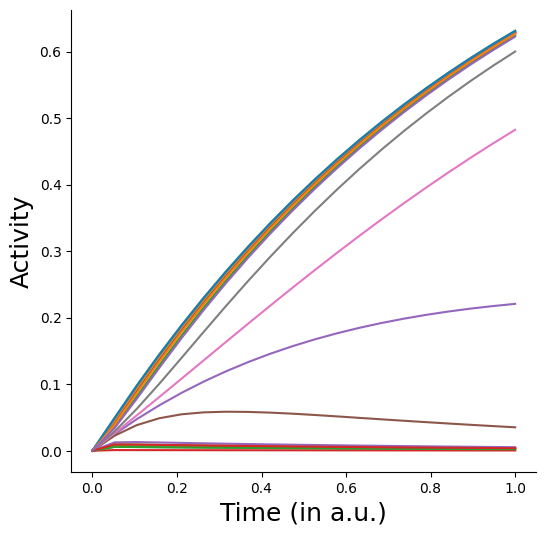

# Running forward dynamics in a connectome-constrained model
The goal of this tutorial is to walk you through the following steps:

- Initializing a sparse neural network model based on a connectome. In this example, we will use the optic lobe of *Drosophila* as done in [Lappalainen et al. (2024)](https://www.nature.com/articles/s41586-024-07939-3).
- Specifying input and output projections.
- Driving activity in the network with visual inputs.

For demonstration purposes, we'll use flattened MNIST images as inputs into the connectome. This is however simplistic and we do allow for arbitrarily complex input mappings. To learn how to do that please refer to the API.


```python
import torch, os
import torchvision.transforms as T
from torch.utils.data import DataLoader
from torchvision.datasets import MNIST
from tqdm import tqdm
import numpy as np
import matplotlib.pyplot as plt

from bioplnn.models import ConnectomeODERNN
```

Check the device to make sure you are on a GPU. If you aren't its not a big deal. Its just going to take much longer!


```python
device = torch.device("cuda" if torch.cuda.is_available() else "cpu")
torch.set_float32_matmul_precision("high")
print('Using device: {}'.format(device))
```

    Using device: cuda


Download the connectome and read it in as a torch tensor. We have pre-processed this as a sparse tensor for the purposes of this example.


```python
!gdown "https://drive.google.com/uc?id=18448HYpYrm60boziHG73bxN4CK5jG-1g"
connectome = torch.load('turaga-dros-visual-connectome.pt', weights_only=True)
```

    Downloading...
    From (original): https://drive.google.com/uc?id=18448HYpYrm60boziHG73bxN4CK5jG-1g
    From (redirected): https://drive.google.com/uc?id=18448HYpYrm60boziHG73bxN4CK5jG-1g&confirm=t&uuid=35c6f337-799b-41ed-a155-7a469ccf8124
    To: /net/vast-storage/scratch/vast/mcdermott/lakshmin/hackathon-test/bioplnn/examples/turaga-dros-visual-connectome.pt
    100%|█████████████████████████████████████████| 111M/111M [00:00<00:00, 112MB/s]


```python
print('Connectome dimensions: {}x{}'.format(connectome.shape[0], connectome.shape[1]))
print('Number of synapses: {}'.format(connectome._nnz()))

spatial_extent = 100
vmin, vmax = connectome.values().min(), connectome.values().max()
fig = plt.figure(figsize=(6, 6))
ax = fig.add_subplot(111)
ax.imshow(torch.abs(connectome.to_dense()[:spatial_extent, :spatial_extent]), cmap='inferno')
ax.set_xlabel('Postsynaptic', fontsize=18)
ax.set_ylabel('Presynaptic', fontsize=18)
ax.set_xticks([0, spatial_extent-1])
ax.set_yticks([0, spatial_extent-1])
plt.show()

```

    Connectome dimensions: 47521x47521
    Number of synapses: 4623254


    

    


## Creating input and output projection matrices
To drive the network with external inputs, you'd want to specify the subset of neurons in the model that receive input or project to downstream areas. We have an utility to create these sparse projection matrices. For the purposes of this example, we shall pick a random subset of input/output neurons. 
In a world where each neuron receives external input, you can also initialize this projection as an arbitrary *dense* matrix.


```python
from bioplnn.utils.torch import create_identity_ih_connectivity
# since we are feeding in MNIST images
input_size = 28 * 28 
num_neurons = connectome.shape[0]

input_projection_matrix = create_identity_ih_connectivity(
                                input_size=input_size,
                                num_neurons=num_neurons,
                                input_indices=torch.randint(high=num_neurons, size=(input_size,))
                            )

# for now, lets just read outputs from all neurons
output_projection_matrix = None
```

## Setting up the connectome-constrained model


```python
connectome_rnn_kwargs = {
        "input_size": input_size,
        "hidden_size": num_neurons,
        "connectivity_hh": connectome,
        "connectivity_ih": input_projection_matrix,
        "output_neurons": output_projection_matrix,
        "nonlinearity": "Sigmoid",
        "batch_first": False,
        "compile_solver_kwargs": {
            "mode": "max-autotune",
            "dynamic": False,
            "fullgraph": True,
        }
}
model = ConnectomeODERNN(**connectome_rnn_kwargs).to(device)
print(model)
```

    ConnectomeODERNN(
      (nonlinearity): Sigmoid()
      (hh): SparseLinear()
      (ih): SparseLinear()
      (layernorm): Identity()
      (solver): OptimizedModule(
        (_orig_mod): AutoDiffAdjoint(step_method=Dopri5(
          (term): ODETerm()
        ), step_size_controller=IntegralController(
          (term): ODETerm()
        ), max_steps=None, backprop_through_step_size_control=True)
      )
    )


```python
# get some data for us to pipe into the model
transform = T.Compose([T.ToTensor(), T.Normalize((0.1307,), (0.3081,))])
train_data = MNIST(root="data", train=True, transform=transform, download=True)
train_loader = DataLoader(
    train_data, batch_size=8, num_workers=0, shuffle=True
)
```


```python
# getting one batch of the input
x, label = next(iter(train_loader))
print(f"x shape: {x.shape}, label_shape: {label.shape}")
x = x.flatten(1)
x = x.to(device)
print(f"x flattened shape: {x.shape}")
```

    x shape: torch.Size([8, 1, 28, 28]), label_shape: torch.Size([8])
    x flattened shape: torch.Size([8, 784])


```python
model.eval()
_, neural_activities, timesteps = model(x, start_time=0, end_time=1.0, num_steps=20)
print(f"Neural activity shape: {neural_activities.shape}")
```

    /scratch2/weka/mcdermott/lakshmin/conda_envs/test_bioplnn_env/lib/python3.12/site-packages/torch/_inductor/cudagraph_trees.py:2345: UserWarning: Unable to hit fast path of CUDAGraphs because of pending, uninvoked backwards. Consider running with torch.no_grad() or using torch.compiler.cudagraph_mark_step_begin() before each model invocation
      warnings.warn(


    Neural activity shape: torch.Size([20, 8, 47521])


```python
fig = plt.figure(figsize=(6,6))
ax = fig.add_subplot(111)
ax.plot(
    timesteps[:, 0].detach().cpu().numpy(), 
    neural_activities[:, 0, torch.randint(0, 47521, (25,))].detach().cpu().numpy()
)
ax.spines['top'].set_visible(False)
ax.spines['right'].set_visible(False)
ax.set_xlabel('Time (in a.u.)', fontsize=18)
ax.set_ylabel('Activity', fontsize=18)
```


    Text(0, 0.5, 'Activity')


    

    

