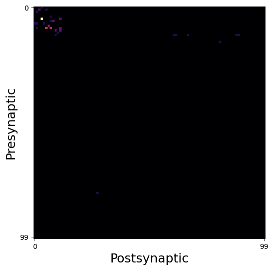
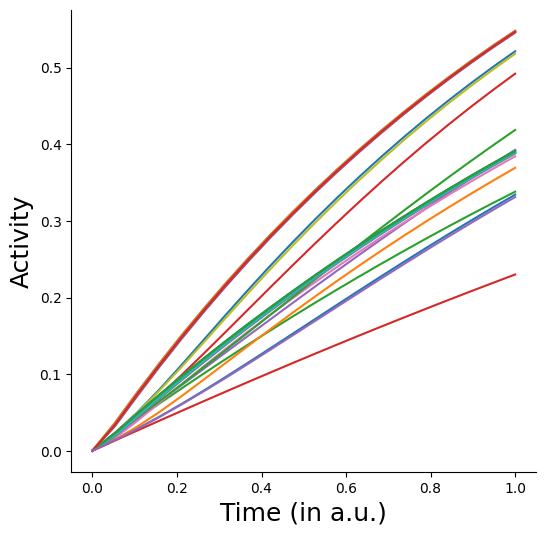

# Connectome-constrained models with neural types

In this tutorial, we extend on the previous example, but now explicitly specify cell-type information for each neuron in our connectome. Cell-types by construction can share parameters such as synapse sign, time constants and nonlinearities.


```python
import torch
import os
import torchvision.transforms as T
from torch.utils.data import DataLoader
from torchvision.datasets import MNIST
from tqdm import tqdm
import numpy as np
import matplotlib.pyplot as plt

from bioplnn.models import ConnectomeODERNN
```

Check the device to make sure you are on a GPU. If you aren't its not a big deal. Its just going to take much longer!


```python
device = torch.device("cuda" if torch.cuda.is_available() else "cpu")
torch.set_float32_matmul_precision("high")
print("Using device: {}".format(device))
```

    Using device: cuda


Download the connectome and read it in as a torch tensor. We have pre-processed this as a sparse tensor for the purposes of this example.
In addition to the connectome from before, we also have typing information preprocessed for you. Feel free to check its contents out.


```python
save_dir = "connectivity/turaga"
os.makedirs(save_dir, exist_ok=True)
save_path = f"{save_dir}/turaga-dros-visual-connectome.pt"
!gdown "https://drive.google.com/uc?id=18448HYpYrm60boziHG73bxN4CK5jG-1g" -O "{save_path}"
connectome = torch.load(save_path, weights_only=True)

save_path_index_1 = f"{save_dir}/example_indices_ntype1.pt"
!gdown "https://drive.google.com/uc?id=19ePGRpMznn2l1Mp8Gu0rTk-PP-EDlyEC" -O "{save_path_index_1}"
ex_indices_neuron_type1 = torch.load(save_path_index_1, weights_only=True)

save_path_index_2 = f"{save_dir}/example_indices_ntype2.pt"
!gdown "https://drive.google.com/uc?id=1eb0H-WTQWg1DzFZ201-ihIFqgZ8u3N0Y" -O "{save_path_index_2}"
ex_indices_neuron_type2 = torch.load(save_path_index_2, weights_only=True)
```

    Downloading...
    From (original): https://drive.google.com/uc?id=18448HYpYrm60boziHG73bxN4CK5jG-1g
    From (redirected): https://drive.google.com/uc?id=18448HYpYrm60boziHG73bxN4CK5jG-1g&confirm=t&uuid=27f9b878-4dc9-4201-8ae8-83319e4db65d
    To: /net/vast-storage/scratch/vast/mcdermott/lakshmin/hackathon-test/bioplnn/examples/connectivity/turaga/turaga-dros-visual-connectome.pt
    100%|████████████████████████████████████████| 111M/111M [00:01<00:00, 89.2MB/s]
    Downloading...
    From: https://drive.google.com/uc?id=19ePGRpMznn2l1Mp8Gu0rTk-PP-EDlyEC
    To: /net/vast-storage/scratch/vast/mcdermott/lakshmin/hackathon-test/bioplnn/examples/connectivity/turaga/example_indices_ntype1.pt
    100%|████████████████████████████████████████| 381k/381k [00:00<00:00, 17.9MB/s]
    Downloading...
    From: https://drive.google.com/uc?id=1eb0H-WTQWg1DzFZ201-ihIFqgZ8u3N0Y
    To: /net/vast-storage/scratch/vast/mcdermott/lakshmin/hackathon-test/bioplnn/examples/connectivity/turaga/example_indices_ntype2.pt
    100%|████████████████████████████████████████| 381k/381k [00:00<00:00, 12.6MB/s]


```python
print(
    "Connectome dimensions: {}x{}".format(
        connectome.shape[0], connectome.shape[1]
    )
)
print("Number of synapses: {}".format(connectome._nnz()))

spatial_extent = 100
vmin, vmax = connectome.values().min(), connectome.values().max()
fig = plt.figure(figsize=(6, 6))
ax = fig.add_subplot(111)
ax.imshow(
    torch.abs(connectome.to_dense()[:spatial_extent, :spatial_extent]),
    cmap="inferno",
)
ax.set_xlabel("Postsynaptic", fontsize=18)
ax.set_ylabel("Presynaptic", fontsize=18)
ax.set_xticks([0, spatial_extent - 1])
ax.set_yticks([0, spatial_extent - 1])
plt.show()

```

    Connectome dimensions: 47521x47521
    Number of synapses: 4623254





## Creating input and output projection matrices
To drive the network with external inputs, you'd want to specify the subset of neurons in the model that receive input or project to downstream areas. We have an utility to create these sparse projection matrices. For the purposes of this example, we shall pick a random subset of input/output neurons.
In a world where each neuron receives external input, you can also initialize this projection as an arbitrary *dense* matrix.


```python
from bioplnn.utils.torch import create_identity_ih_connectivity

# since we are feeding in MNIST images
input_size = 28 * 28
num_neurons = connectome.shape[0]

input_projection_matrix = create_identity_ih_connectivity(
    input_size=input_size,
    num_neurons=num_neurons,
    input_indices=torch.randint(high=num_neurons, size=(input_size,)),
)

# for now, lets just read outputs from all neurons
output_projection_matrix = None
```

## Setting up the connectome-constrained model


```python
connectome_rnn_kwargs = {
    "input_size": input_size,
    "hidden_size": num_neurons,
    "connectivity_hh": connectome,
    "connectivity_ih": input_projection_matrix,
    "output_neurons": output_projection_matrix,
    "num_neuron_types": 2,

    # this is new!
    "neuron_type_class": ["excitatory", "inhibitory"],
    "neuron_type_indices": [
        ex_indices_neuron_type1,
        ex_indices_neuron_type2,
    ],

    # note how the nonlinearity is global -- it can be per-celltype if needed
    # also note how the taus are initialized per neuron type.
    "neuron_type_nonlinearity": "Sigmoid",
    "neuron_type_tau_init": [1.25, 2.0],

    # flag to determine if these are tunable via gradients. same holds true for synaptic gains.
    "train_tau": True,
    "batch_first": False,
    "compile_solver_kwargs": {
        "mode": "max-autotune",
        "dynamic": False,
        "fullgraph": True,
    },
}
model = ConnectomeODERNN(**connectome_rnn_kwargs).to(device)
print(model)
```

    ConnectomeODERNN(
      (nonlinearity): Sigmoid()
      (hh): SparseLinear()
      (ih): SparseLinear()
      (solver): OptimizedModule(
        (_orig_mod): AutoDiffAdjoint(step_method=Dopri5(
          (term): ODETerm()
        ), step_size_controller=IntegralController(
          (term): ODETerm()
        ), max_steps=None, backprop_through_step_size_control=True)
      )
      (neuron_type_indices): ParameterList(
          (0): Parameter containing: [torch.int64 of size 23760 (cuda:0)]
          (1): Parameter containing: [torch.int64 of size 23761 (cuda:0)]
      )
      (neuron_type_nonlinearity): ModuleList(
        (0-1): 2 x Sigmoid()
      )
    )


```python
# get some data for us to pipe into the model
transform = T.Compose([T.ToTensor(), T.Normalize((0.1307,), (0.3081,))])
train_data = MNIST(root="data", train=True, transform=transform, download=True)
train_loader = DataLoader(
    train_data, batch_size=8, num_workers=0, shuffle=True
)
```


```python
# getting one batch of the input
x, label = next(iter(train_loader))
print(f"x shape: {x.shape}, label_shape: {label.shape}")
x = x.flatten(1)
x = x.to(device)
print(f"x flattened shape: {x.shape}")
```

    x shape: torch.Size([8, 1, 28, 28]), label_shape: torch.Size([8])
    x flattened shape: torch.Size([8, 784])


```python
model.eval()
_, neural_activities, timesteps = model(
    x, start_time=0, end_time=1.0, num_steps=20
)
print(f"Neural activity shape: {neural_activities.shape}")
```

    Neural activity shape: torch.Size([20, 8, 47521])


    /scratch2/weka/mcdermott/lakshmin/conda_envs/test_bioplnn_env/lib/python3.12/site-packages/torch/_inductor/cudagraph_trees.py:2345: UserWarning: Unable to hit fast path of CUDAGraphs because of pending, uninvoked backwards. Consider running with torch.no_grad() or using torch.compiler.cudagraph_mark_step_begin() before each model invocation
      warnings.warn(


```python
fig = plt.figure(figsize=(6, 6))
ax = fig.add_subplot(111)
ax.plot(
    timesteps[:, 0].detach().cpu().numpy(),
    neural_activities[:, 0, torch.randint(0, 47521, (25,))]
    .detach()
    .cpu()
    .numpy(),
)
ax.spines["top"].set_visible(False)
ax.spines["right"].set_visible(False)
ax.set_xlabel("Time (in a.u.)", fontsize=18)
ax.set_ylabel("Activity", fontsize=18)
```


    Text(0, 0.5, 'Activity')



